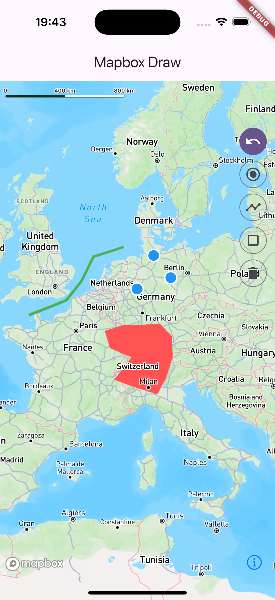

<!--
This README describes the package. If you publish this package to pub.dev,
this README's contents appear on the landing page for your package.

For information about how to write a good package README, see the guide for
[writing package pages](https://dart.dev/tools/pub/writing-package-pages).

For general information about developing packages, see the Dart guide for
[creating packages](https://dart.dev/guides/libraries/create-packages)
and the Flutter guide for
[developing packages and plugins](https://flutter.dev/to/develop-packages).
-->

# Mapbox Maps Flutter Draw

A Flutter package to draw, edit, and delete polygons on a Mapbox map using the [mapbox_maps_flutter](https://github.com/mapbox/mapbox-maps-flutter) library. This package helps in creating and managing polygon annotations interactively.

## Features

- **Draw Polygons**: Add points on a Mapbox map to create a polygon.
- **Delete Polygons**: Enable delete mode to remove polygons by tapping them.
- **Undo Last Point**: Undo the last point added while drawing a polygon.
- **Manage Multiple Polygons**: Store and retrieve multiple polygons.




## Getting started

To use this package, add `mapbox_maps_flutter_draw` and its dependencies to your `pubspec.yaml` file:

```yaml
dependencies:
  mapbox_maps_flutter: ^<latest_version>
  mapbox_maps_flutter_draw:
  provider:
```

## Usage

Please check out the [example](./example/) project for a full example.

```dart
@override
Widget build(BuildContext context) {
    _mapboxDrawController = Provider.of<MapboxDrawController>(context);

    ...

    // this is the mapbox_maps_flutter (https://github.com/mapbox/mapbox-maps-flutter) map
    MapWidget(
        styleUri: MapboxStyles.STANDARD,
        onMapCreated: (mapInstance) async {
            await _mapboxDrawController.initialize(mapInstance);

            // sample polygons
            final polygonString = [
                '{"type":"Polygon","bbox":null,"coordinates":[[[-18.930236903430682,65.54258945880892],[-41.305603332322534,56.12495372403541],[-23.143507455464942,47.51318115957886],[-13.42744079577011,50.491865810367415]]]}',
                '{"type":"Polygon","bbox":null,"coordinates":[[[19.172957996449043,49.30508658266342],[12.380430916160435,33.47371340190411],[-2.592100951914972,35.36674553163404],[0.04248170102297877,51.60826115068258]]]}'
            ];

            _mapboxDrawController.add(
                polygonString
                    .map((e) => Polygon.fromJson(jsonDecode(e)))
                    .toList(),
            );
        },
    ),
    IconButton.filled(
        icon: _mapboxDrawController.editingMode == EditingMode.DRAW_POLYGON
            ? const Icon(Icons.done)
            : const Icon(Icons.add),
        onPressed: () =>
            _mapboxDrawController.toggleEditing(),
    ),
    IconButton.filled(
        icon: const Icon(Icons.undo),
        onPressed: (_mapboxDrawController.polygonPoints.isEmpty)
            ? null
            : () => _mapboxDrawController.undoLastPoint(),
    ),
    IconButton.filled(
        icon: const Icon(Icons.delete),
        onPressed: () {
            _mapboxDrawController.toggleDeleteMode();
        },
    )
}
```

## API Overview
- `initialize(MapboxMap mapController)`: Initializes the controller with the Mapbox map instance.
- `toggleEditing()`: Toggles between polygon drawing mode and normal mode.
- `toggleDeleteMode()`: Toggles between delete mode and normal mode.
- `undoLastPoint()`: Removes the last added point in drawing mode.
- `add(List<Polygon> existingPolygons)`: Adds existing polygons to the map.

## License
This package is licensed under the [MIT License](./LICENSE).


